<div align="center">


# Al-Sami Creation's — Order & Customer Management

**A full-stack workshop management system for a boutique dress-making business.**
Customer records, per-size order tracking, returns, inventory and business insights — in one app, built for real day-to-day shop floor use.

[](https://nextjs.org/)
[](https://react.dev/)
[](https://www.typescriptlang.org/)
[](https://tailwindcss.com/)
[](https://supabase.com/)
[](https://vercel.com/)

### 🔗 [**View Live App →**](https://al-sami-creations.vercel.app) <!-- confirm this is your primary domain under Vercel → Settings → Domains before publishing, and update if different -->

</div>

---

## 📖 About

Al-Sami Creation's is a boutique tailoring workshop that needed to replace pen-and-paper order books with something faster, clearer, and accessible from any device. This app was built end-to-end — database design, authentication, role-based permissions, and a mobile-first UI — to match exactly how the shop's staff already think about their work: a WhatsApp-style list of customers, one tap into their order history, and a simple Hisaab (accounts) view for business insights.

The interface is written in **Roman Urdu**, the language the shop's staff actually use day to day — because software should adapt to the people using it, not the other way around.

---

## ✨ Features

- 💬 **WhatsApp-style customer list** — photo, phone number, and factory code at a glance, searchable instantly
- 🧾 **Per-customer order history** — every order auto-numbered, filterable by **Pending / Partial / Closed / History**
- 📏 **Size-level quantity tracking** — every article ordered and delivered is tracked per size (XS–XL), with automatic running totals
- ✅ **Partial delivery support** — close an order fully or partially as pieces are handed over; status updates automatically
- ↩️ **Returns log** — a fully separate, auditable log of returned pieces per customer, per article, per size
- 👕 **Article (inventory) management** — every dress/article in the catalog, sorted automatically by demand, with live order & return counts
- 📊 **Hisaab Kitaab (Insights)** — date-range analytics (today / this week / 2 weeks / this month / custom range): top-demand articles, top-ordering customers, top-returning customers
- 🔐 **Role-based access** — Admin and Staff share the same day-to-day tools; only Admins can create staff logins or permanently delete records
- 🗑️ **Full audit-safe CRUD** — admins can delete customers, articles, orders, and staff logins, enforced at the database level (not just hidden in the UI)
- 📱 **Mobile-first, desktop-friendly** — a single responsive codebase that works identically on a shop-floor phone and a back-office laptop
- 🎨 **Custom boutique branding** — maroon & gold theme, custom logo, Poppins + Playfair Display typography

---

## 📸 Screenshots

<table>
<tr>
<td align="center" width="50%"><b>Login</b><br/>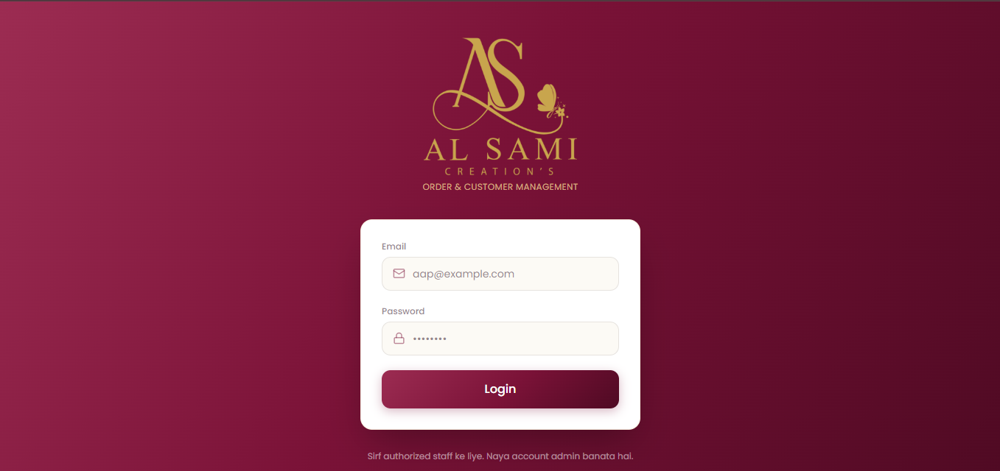</td>
<td align="center" width="50%"><b>Login (Mobile)</b><br/>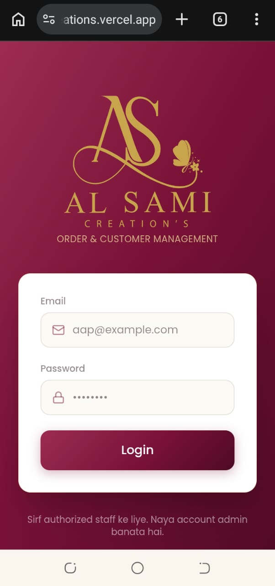</td>
</tr>
<tr>
<td align="center"><b>Customer List</b><br/>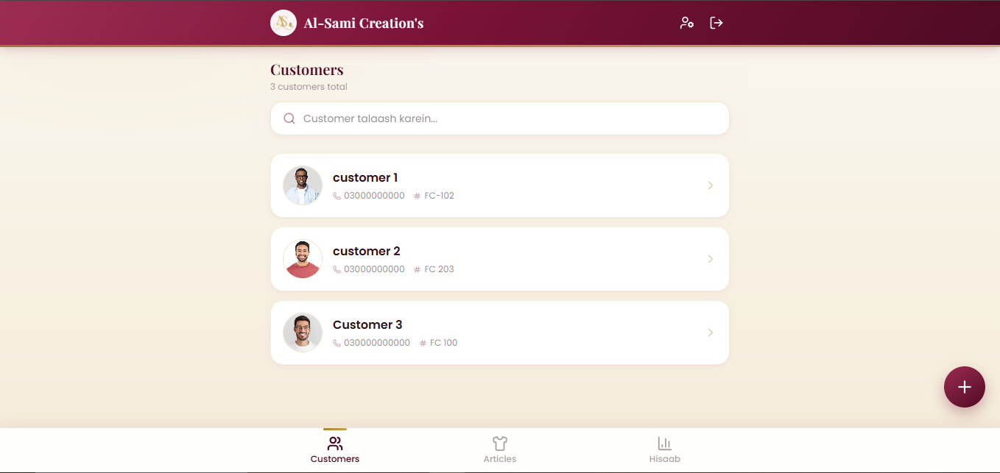</td>
<td align="center"><b>Customer List (Mobile)</b><br/>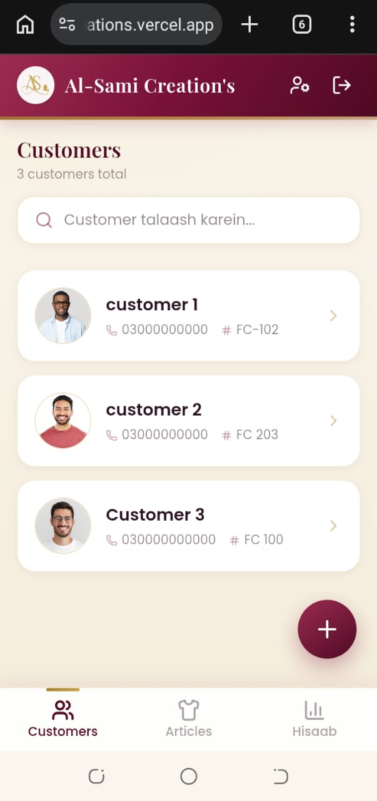</td>
</tr>
<tr>
<td align="center"><b>Order Screen — Pending</b><br/>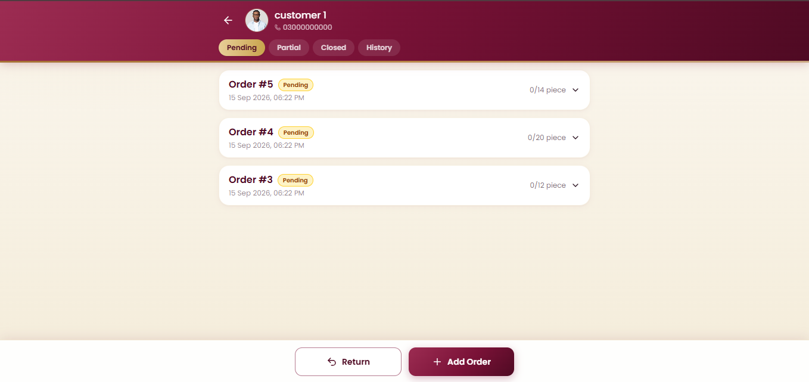</td>
<td align="center"><b>Order Screen (Mobile)</b><br/>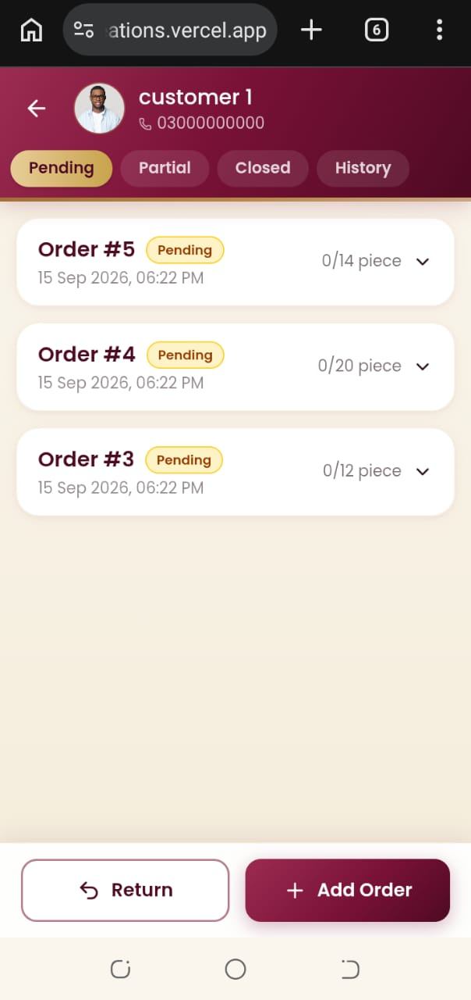</td>
</tr>
<tr>
<td align="center"><b>Order Expanded — Size Breakdown</b><br/>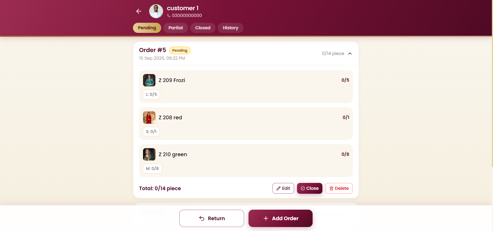</td>
<td align="center"><b>Order Expanded (Mobile)</b><br/>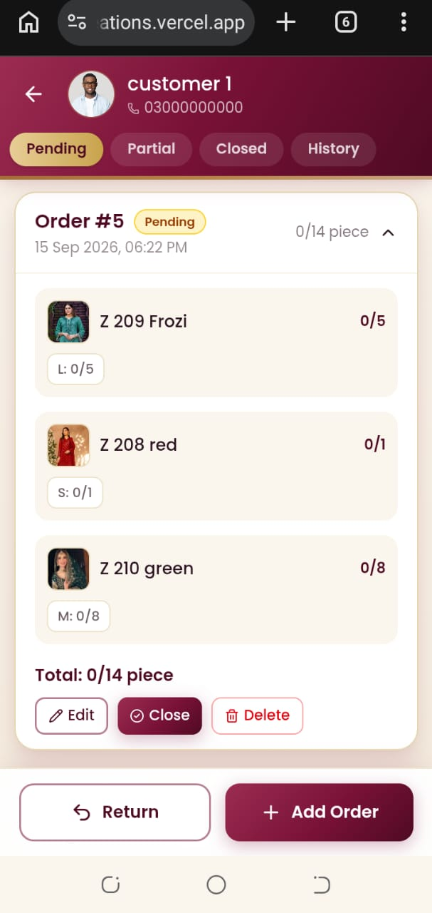</td>
</tr>
<tr>
<td align="center"><b>Partial Delivery</b><br/>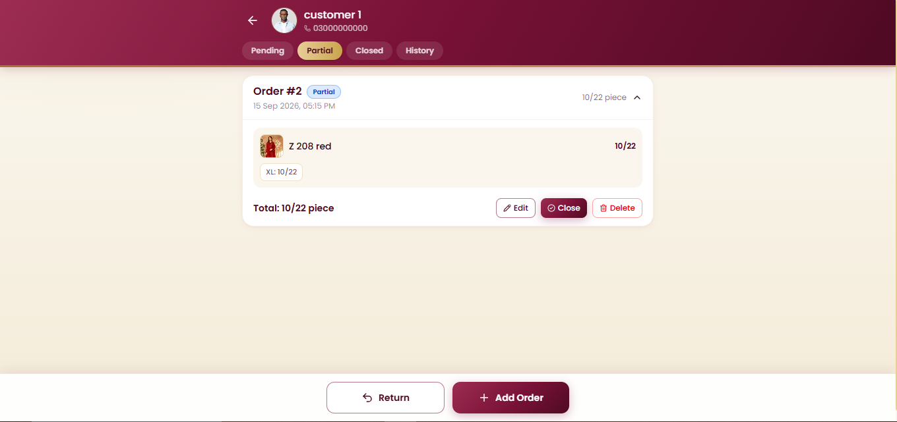</td>
<td align="center"><b>Closed Order</b><br/>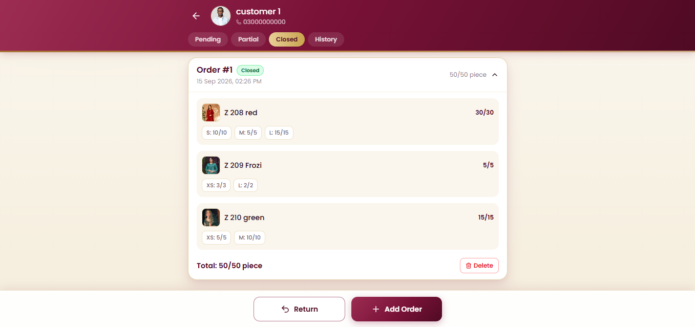</td>
</tr>
<tr>
<td align="center"><b>Order History Timeline</b><br/>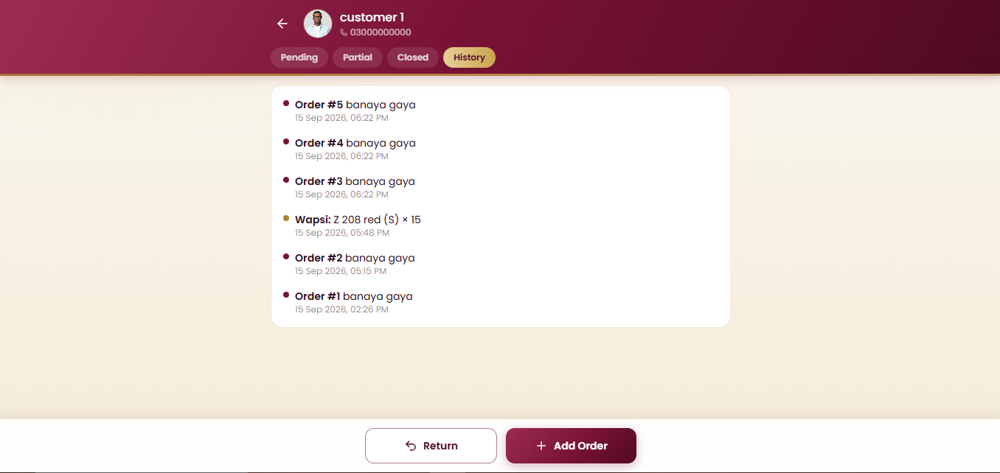</td>
<td align="center"><b>Customer Details</b><br/>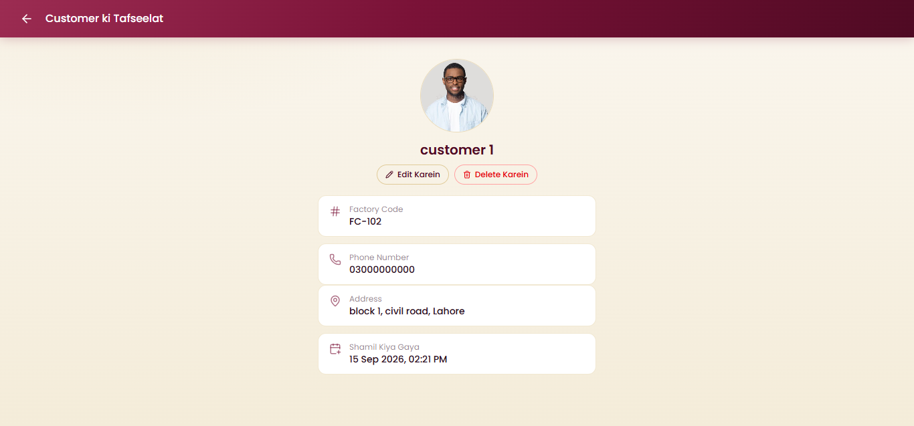</td>
</tr>
<tr>
<td align="center"><b>Articles — Sorted by Demand</b><br/>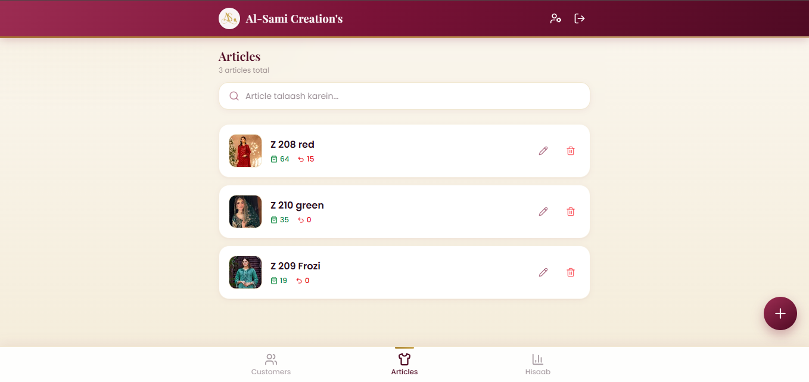</td>
<td align="center"><b>Articles (Mobile)</b><br/>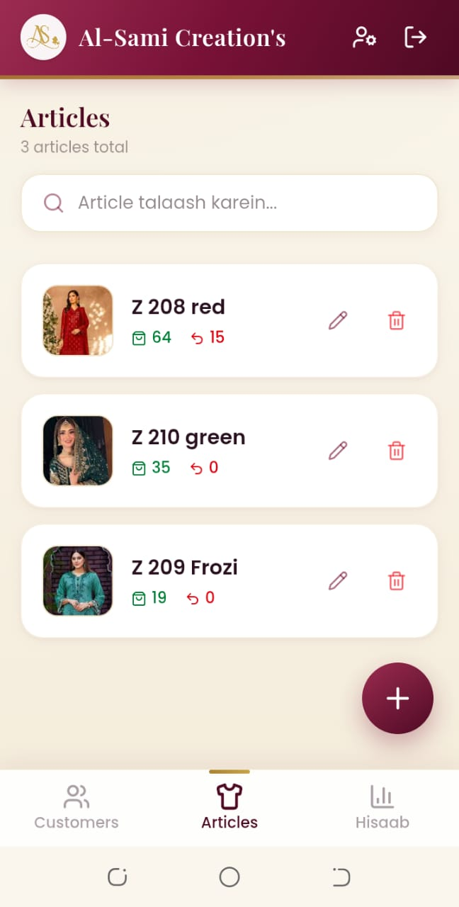</td>
</tr>
<tr>
<td align="center"><b>Hisaab Kitaab — Insights</b><br/>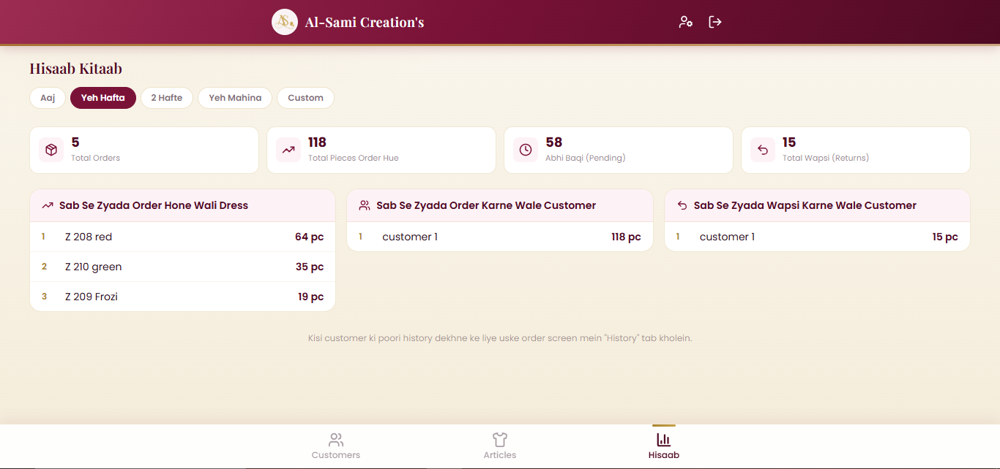</td>
<td align="center"><b>Hisaab (Mobile)</b><br/>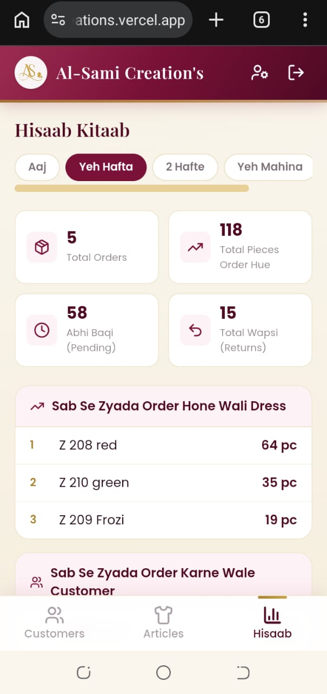</td>
</tr>
</table>

---

## 🛠️ Tech Stack

| Layer | Technology |
|---|---|
| **Framework** | [Next.js 16](https://nextjs.org/) (App Router, Turbopack) |
| **Language** | [TypeScript](https://www.typescriptlang.org/) |
| **UI** | [React 19](https://react.dev/) + [Tailwind CSS 4](https://tailwindcss.com/) |
| **Icons** | [Lucide React](https://lucide.dev/) |
| **Backend & Database** | [Supabase](https://supabase.com/) — Postgres, Row Level Security |
| **Authentication** | Supabase Auth (email + password) |
| **File Storage** | Supabase Storage (customer & article photos) |
| **Hosting** | [Vercel](https://vercel.com/) |

---

## 🔐 Roles & Permissions

| Action | Staff | Admin |
|---|:---:|:---:|
| View customers, orders, articles, Hisaab | ✅ | ✅ |
| Create / edit customers, orders, articles | ✅ | ✅ |
| Log a return | ✅ | ✅ |
| Close / partial-close an order | ✅ | ✅ |
| **Delete** a customer, article, or order | ❌ | ✅ |
| Create a new staff login | ❌ | ✅ |
| **Delete** a staff login | ❌ | ✅ |

Permissions are enforced in **two layers**: hidden in the UI for a clean staff experience, and separately enforced by Postgres Row Level Security policies — so they hold even if someone calls the API directly.

---

## 🗂️ Project Structure

```
al-sami-workshop/
├─ src/
│  ├─ app/
│  │  ├─ (app)/                # Authenticated app shell (bottom nav, header)
│  │  │  ├─ customers/         # Customer list, order screen, customer detail
│  │  │  ├─ articles/          # Article/inventory management
│  │  │  ├─ hisaab/            # Date-range business insights
│  │  │  └─ users/             # Admin-only staff management
│  │  ├─ api/users/            # Server route — admin-only user create/delete
│  │  └─ login/                # Auth screen
│  ├─ components/               # Reusable UI: modals, cards, avatar, nav
│  └─ lib/                      # Supabase clients, types, utilities
├─ supabase/
│  └─ schema.sql                # Full DB schema, triggers, RLS policies
└─ public/                      # Logo assets, icons
```

---

## 🚀 Getting Started

### Prerequisites
- [Node.js](https://nodejs.org/) 20+
- A free [Supabase](https://supabase.com/) project
- A [Vercel](https://vercel.com/) account (for deployment)

### 1. Clone & install

```bash
git clone https://github.com/devawais01/al-sami-creations.git
cd al-sami-creations
npm install
```

### 2. Configure environment variables

Copy the example file and fill in your own Supabase project values (**Project Settings → API**):

```bash
cp .env.local.example .env.local
```

| Variable | Where to find it | Used |
|---|---|---|
| `NEXT_PUBLIC_SUPABASE_URL` | Project Settings → API → Project URL | Client & server |
| `NEXT_PUBLIC_SUPABASE_ANON_KEY` | Project Settings → API → anon / public key | Client & server |
| `SUPABASE_SERVICE_ROLE_KEY` | Project Settings → API → service_role key | **Server only** — powers admin user management, never exposed to the browser |

### 3. Set up the database

Open **Supabase Dashboard → SQL Editor → New query**, paste the entire contents of [`supabase/schema.sql`](./supabase/schema.sql), and run it. This creates every table, trigger, and Row Level Security policy the app needs. It's safe to re-run any time — every statement is idempotent.

### 4. Configure Supabase Auth

- **Authentication → Providers** — make sure **Email** is enabled
- **Authentication → Settings** — turn **off** "Confirm email" (so new staff logins work instantly without an email step)

### 5. Run locally

```bash
npm run dev
```

Open [http://localhost:3000](http://localhost:3000). The **first account to sign up automatically becomes Admin** — every account after that is created by an Admin via the Users screen.

---

## ☁️ Deployment

This project is deployed on **Vercel**:

1. Import the GitHub repo into Vercel
2. Add the same three environment variables from step 2 above under **Project Settings → Environment Variables**
3. Push to `main` — Vercel builds and deploys automatically

---

## 🔒 Security Notes

- Row Level Security is enabled on every table — no data is readable or writable without a valid authenticated session
- Admin-only actions (deletes, staff management) are enforced at the database level via a `is_admin()` Postgres function, not just hidden in the UI
- The Supabase **service role key** is used only inside a server-side API route and is never bundled into client-side code
- Photo uploads go through Supabase Storage with public-read buckets scoped specifically to `customer-photos` and `article-photos`

---

## 📄 License

This project was built as commissioned client work for **Al-Sami Creation's**. All rights to the business logic, branding, and data are reserved by the client. The codebase is shared publicly as a portfolio reference.

---

<div align="center">

Built with ❤️ by **[Awais](https://github.com/devawais01)**

</div>
